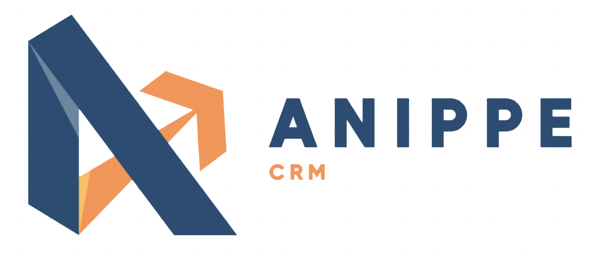
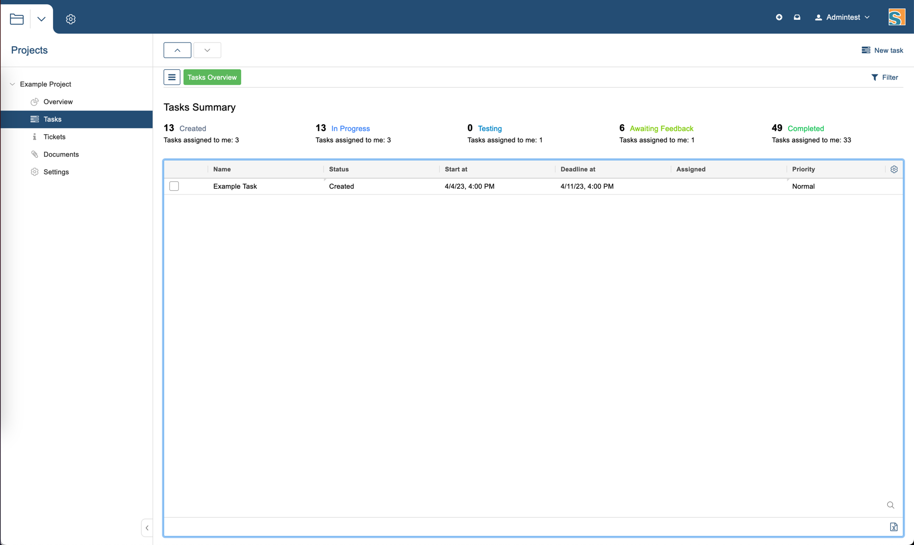

<!-- Improved compatibility of back to top link: See: https://github.com/othneildrew/Best-README-Template/pull/73 -->
<a name="readme-top"></a>
<!--
*** Thanks for checking out the Best-README-Template. If you have a suggestion
*** that would make this better, please fork the repo and create a pull request
*** or simply open an issue with the tag "enhancement".
*** Don't forget to give the project a star!
*** Thanks again! Now go create something AMAZING! :D
-->


<!-- PROJECT SHIELDS -->
<!--
*** I'm using markdown "reference style" links for readability.
*** Reference links are enclosed in brackets [ ] instead of parentheses ( ).
*** See the bottom of this document for the declaration of the reference variables
*** for contributors-url, forks-url, etc. This is an optional, concise syntax you may use.
*** https://www.markdownguide.org/basic-syntax/#reference-style-links
-->
[![Contributors][contributors-shield]][contributors-url]
[![Forks][forks-shield]][forks-url]
[![Stargazers][stars-shield]][stars-url]
[![Issues][issues-shield]][issues-url]
[![MIT License][license-shield]][license-url]
[![LinkedIn][linkedin-shield]][linkedin-url]


<!-- PROJECT LOGO -->
<br />
<div align="center">
  <a href="https://github.com/lukacavic/anippe">
    
  </a>

<h3 align="center">Anippe CRM</h3>

  <p align="center">
    PerfexCRM clone made with Eclipse Scout Framework
    <br />
    <a href="https://github.com/lukacavic/anippe"><strong>Explore the docs »</strong></a>
    <br />
    <br />
    <a href="#">View Demo (soon)</a>
    ·
    <a href="https://github.com/lukacavic/anippe/issues">Report Bug</a>
    ·
    <a href="https://github.com/lukacavic/anippe/issues">Request Feature</a>
  </p>
</div>


<!-- TABLE OF CONTENTS -->
<details>
  <summary>Table of Contents</summary>
  <ol>
    <li>
      <a href="#about-the-project">About The Project</a>
      <ul>
        <li><a href="#built-with">Built With</a></li>
      </ul>
    </li>
    <li>
      <a href="#getting-started">Getting Started</a>
      <ul>
        <li><a href="#prerequisites">Prerequisites</a></li>
        <li><a href="#installation">Installation</a></li>
      </ul>
    </li>
    <li><a href="#contributing">Contributing</a></li>
    <li><a href="#license">License</a></li>
  </ol>
</details>


<!-- ABOUT THE PROJECT -->
## About The Project



Purpose of this project is to build PerfexCRM clone using Eclipse Scout framework and PostgreSQL database.
<p align="right">(<a href="#readme-top">back to top</a>)</p>


### Built With

* Eclipse Scout Framework
* Postgres SQL database

<p align="right">(<a href="#readme-top">back to top</a>)</p>


<!-- GETTING STARTED -->
## Getting Started

 

### Prerequisites

In order to run this project you need to install Node.js, pnpm, AdoptJDK 11, PostgreSQL.

Please visit this [url](https://eclipsescout.github.io/scout-docs/23.1/getstarted/helloscout.html) to learn how to install and prepare Eclipse/IntellJ, Node.js, pnpm.

### How to setup

1. Clone repository 
2. Import it into IntelliJ/Eclipse as Maven project.
3. Wait Maven to build and fetch all dependencies
4. Open anippe.server.app.dev /src/main/resources/config.properties.example and rename it to config.properties. Edit the file and add your own DB credentials and JDBC url.
   ```java
    db.url=jdbc:postgresql://localhost:5432/anippe
    db.username=postgres
    db.password=postgres
   ```
5. From Run Configurations select weball. This will run webpack to build JS and LESS files and after that run server and client. After that open Anippe CRM using:
   ```java
    http://localhost:8082
   
   Login using: admintest/admin
   ```
<p align="right">(<a href="#readme-top">back to top</a>)</p>

<!-- CONTRIBUTING -->
## Contributing

Contributions are what make the open source community such an amazing place to learn, inspire, and create. Any contributions you make are **greatly appreciated**.

If you have a suggestion that would make this better, please fork the repo and create a pull request. You can also simply open an issue with the tag "enhancement".
Don't forget to give the project a star! Thanks again!

1. Fork the Project
2. Create your Feature Branch (`git checkout -b feature/AmazingFeature`)
3. Commit your Changes (`git commit -m 'Add some AmazingFeature'`)
4. Push to the Branch (`git push origin feature/AmazingFeature`)
5. Open a Pull Request

<p align="right">(<a href="#readme-top">back to top</a>)</p>


<!-- LICENSE -->
## License

Distributed under the MIT License. See `LICENSE.txt` for more information.

<p align="right">(<a href="#readme-top">back to top</a>)</p>

<!-- MARKDOWN LINKS & IMAGES -->
<!-- https://www.markdownguide.org/basic-syntax/#reference-style-links -->
[contributors-shield]: https://img.shields.io/github/contributors/lukacavic/anippe.svg?style=for-the-badge
[contributors-url]: https://github.com/lukacavic/anippe/graphs/contributors
[forks-shield]: https://img.shields.io/github/forks/lukacavic/anippe.svg?style=for-the-badge
[forks-url]: https://github.com/lukacavic/anippe/network/members
[stars-shield]: https://img.shields.io/github/stars/lukacavic/anippe.svg?style=for-the-badge
[stars-url]: https://github.com/lukacavic/anippe/stargazers
[issues-shield]: https://img.shields.io/github/issues/lukacavic/anippe.svg?style=for-the-badge
[issues-url]: https://github.com/lukacavic/anippe/issues
[license-shield]: https://img.shields.io/github/license/lukacavic/anippe.svg?style=for-the-badge
[license-url]: https://github.com/lukacavic/anippe/blob/master/LICENSE.txt
[linkedin-shield]: https://img.shields.io/badge/-LinkedIn-black.svg?style=for-the-badge&logo=linkedin&colorB=555
[linkedin-url]: https://linkedin.com/in/linkedin_username
[product-screenshot]: images/screenshot.png
[Next.js]: https://img.shields.io/badge/next.js-000000?style=for-the-badge&logo=nextdotjs&logoColor=white
[Next-url]: https://nextjs.org/
[React.js]: https://img.shields.io/badge/React-20232A?style=for-the-badge&logo=react&logoColor=61DAFB
[React-url]: https://reactjs.org/
[Vue.js]: https://img.shields.io/badge/Vue.js-35495E?style=for-the-badge&logo=vuedotjs&logoColor=4FC08D
[Vue-url]: https://vuejs.org/
[Angular.io]: https://img.shields.io/badge/Angular-DD0031?style=for-the-badge&logo=angular&logoColor=white
[Angular-url]: https://angular.io/
[Svelte.dev]: https://img.shields.io/badge/Svelte-4A4A55?style=for-the-badge&logo=svelte&logoColor=FF3E00
[Svelte-url]: https://svelte.dev/
[Laravel.com]: https://img.shields.io/badge/Laravel-FF2D20?style=for-the-badge&logo=laravel&logoColor=white
[Laravel-url]: https://laravel.com
[Bootstrap.com]: https://img.shields.io/badge/Bootstrap-563D7C?style=for-the-badge&logo=bootstrap&logoColor=white
[Bootstrap-url]: https://getbootstrap.com
[JQuery.com]: https://img.shields.io/badge/jQuery-0769AD?style=for-the-badge&logo=jquery&logoColor=white
[JQuery-url]: https://jquery.com 
